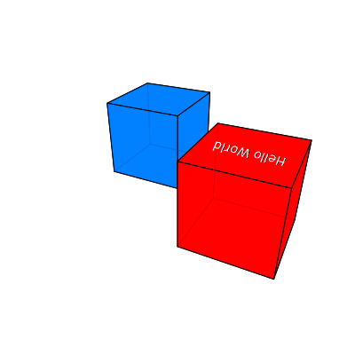

# @tscircuit/simple-3d-svg

An extremely simple 3D SVG renderer.

[Online Playground](https://simple-3d-svg.vercel.app/?fixture=%7B%22path%22%3A%22examples%2Finteractive.page.tsx%22%7D) ・ [Blog Post](https://seve.blog/p/i-made-a-3d-svg-renderer-that-projects)



## Usage

```ts
import { renderScene } from "@tscircuit/simple-3d-svg"

renderScene({
  boxes: [
    {
      center: { x: -1.5, y: 0, z: 6 },
      topLabel: "Hello World",
      topLabelColor: "white",
      faceImages: { top: "data:image/gif;base64,R0lGODlhAQABAIAAAAAAAP///ywAAAAAAQABAAACAUwAOw==" },
      size: { x: 2, y: 2, z: 2 },
      color: "rgba(255, 0, 0, 0.9)",
    },
    {
      center: { x: 1.5, y: 0, z: 8 },
      size: { x: 2, y: 2, z: 2 },
      color: [0, 128, 255, 0.9],
    },
  ],
  camera: { position: { x: -3, y: 4, z: 0 }, lookAt: { x: 0, y: 0, z: 6 } },
})
// "<svg>...</svg>"
```

## Motivation

[tscircuit](https://github.com/tscircuit/tscircuit) projects often need to check
the position of 3D objects relative to each other or see "3D Previews" of
printed circuit boards for visual snapshot testing. However, 3D viewers are often reliant on heavy
dependencies or browser features making them less portable and consistent.

`@tscircuit/simple-3d-svg` is a fully-typescript, zero-dependency SVG 3d
renderer that allows checking the positions and sizes of 3D objects in a scene
for visual snapshot testing.

## Notes

- To correctly transform text for 3D, you need a perspective transform. However, the SVG spec only provides affine transforms. As a result, the text on the top of boxes will always look slighly "off".
- You can project an image onto the top face of a box by providing `faceImages.top` with a data URI. The renderer uses two clipped images to achieve a perspective-correct mapping.

## Advanced Configuration

You can customize the rendering behavior by providing an options object as the second argument to `renderScene`.

### `focalLength`

The `focalLength` option (default: `2`) controls the perspective effect. Smaller values create a more pronounced perspective (wide-angle lens), while larger values create a flatter perspective (telephoto lens).

```ts
renderScene(
  {
    /* ... scene definition ... */
    camera: {
      position: { x: -3, y: 4, z: 0 },
      lookAt: { x: 0, y: 0, z: 6 },
      focalLength: 1.5, // Closer to a wide-angle lens
    },
  },
  {
    /* ... other options ... */
  },
)
```

### `backgroundColor`

The `backgroundColor` option allows you to set the background color of the SVG. It accepts a color string (e.g., `"white"`, `"#FF0000"`) or an RGBA tuple (e.g., `[255, 255, 255, 1]`).

```ts
renderScene(
  {
    /* ... scene definition ... */
  },
  {
    backgroundColor: "lightblue",
    // or
    // backgroundColor: [173, 216, 230, 1]
  },
)
```
